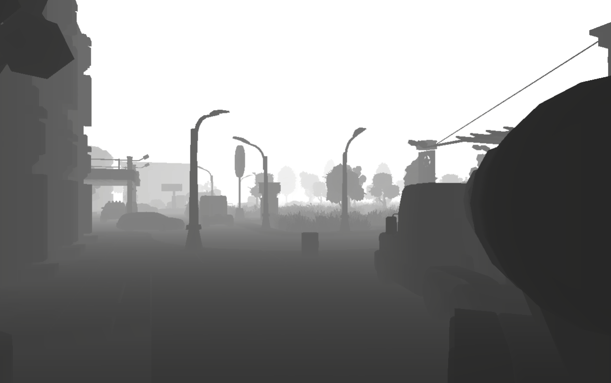
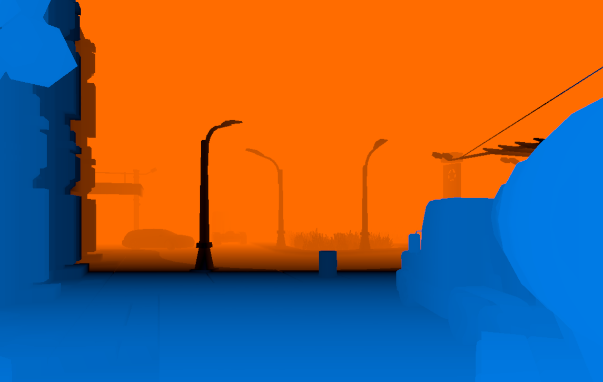
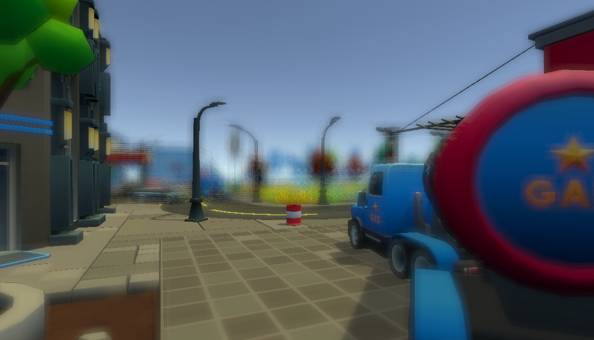
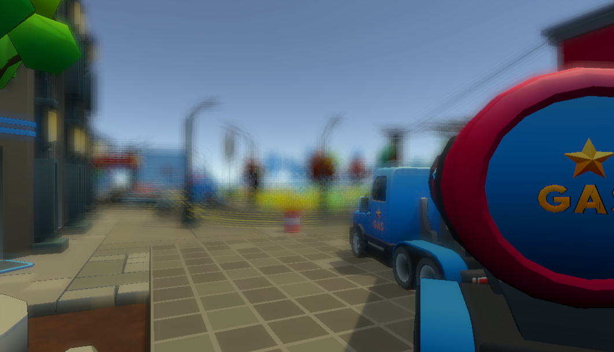
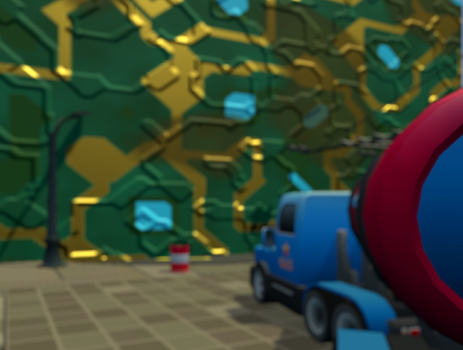
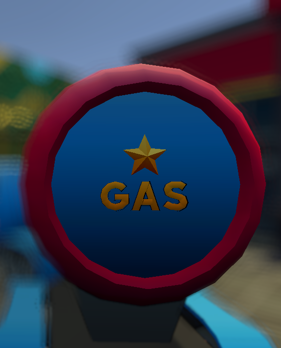
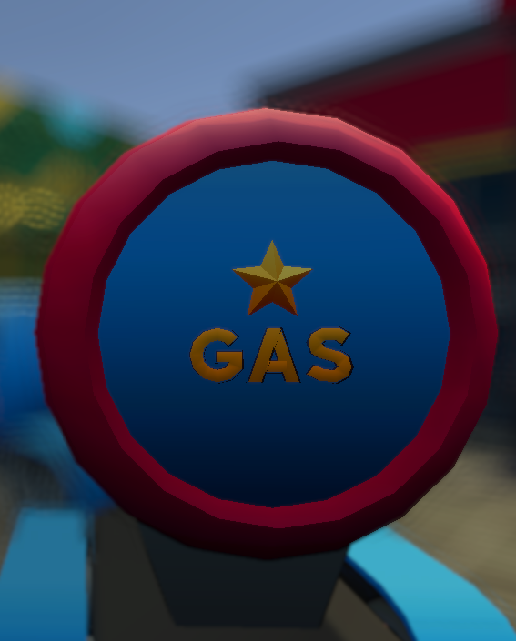
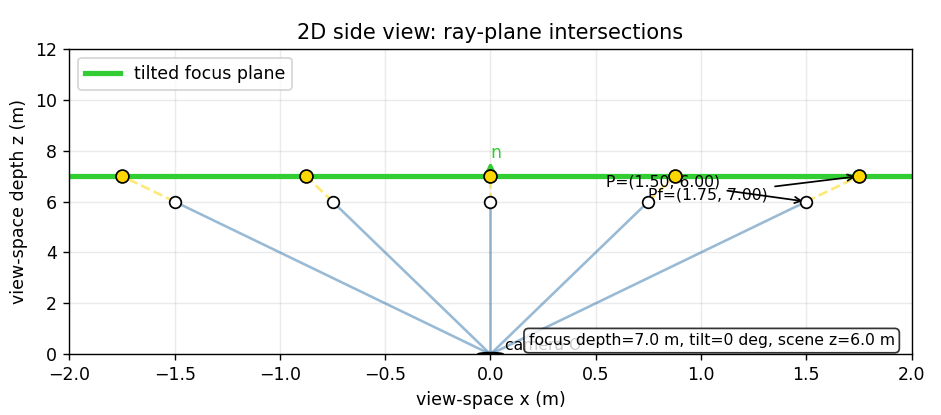
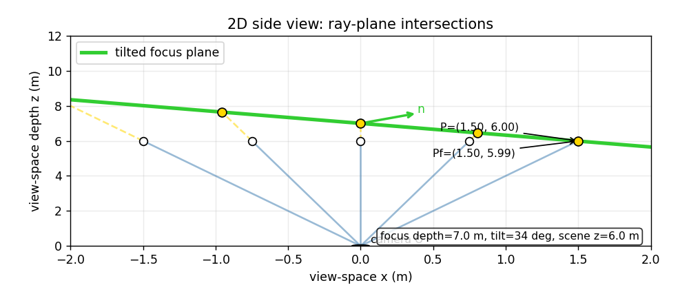
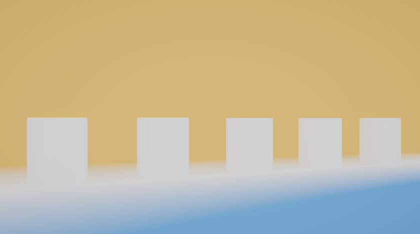

# Tilt-Shift Depth of Field in Unity URP

This project implements a custom depth-of-field and tilt-shift post-processing effect in Unity's Universal Render Pipeline. The work started with simple fullscreen shader experiments and gradually developed into a multi-pass bokeh pipeline driven by a camera-inspired circle of confusion calculation and a tilted focus plane.

## Final Result

The final effect can be tuned from the renderer feature inspector. The main view below shows the same scene without the custom effect, with ordinary depth of field, and with an X-axis tilted focus plane.

**No custom DOF**


Everything is sharp.

**DOF enabled**


Foreground and background are blurred.

**X-axis tilt**


The focused area is now smaller with tilt.


The second view was set up to show Y-axis tilt. The drums are arranged in a line, and the focus plane can be rotated so that more of them fall within the focused region.

**No Y-axis tilt**


The middle drum is in focus while the others are blurred.

**Y-axis tilt**


The tilted focal plane makes all the drums in focus at the same time.

## Project Progress

Below are some highlights and milestones of the project, showcasing the steps and iterations of the DOF and Tilt effect before the final implementation. The sections are ordered (more or less) chronologically.

## Early Experiments: Depth and CoC

The first steps was learning how to write a fullscreen post-processing shader in URP. The first thing I made was a "shader" that sampled the camera depth texture and visualized linear depth.



Once depth was available, the first circle of confusion was based on a simple depth difference:

```text
CoC = (depth - focusDistance) / focusRange
```

This was not physically accurate, but I just wanted something simple for testing. The debug view colored pixels in front of the focus plane differently from pixels behind it, with the focus region near black.



## First DOF Prototype

The first working depth-of-field version blurred the image and blended between the sharp and blurred versions using the CoC value. This made the effect recognizable as depth of field, but the blur quality was still rough.

| Focus on lamppost | Focus on truck |
|---|---|
|  |  |

At this stage most of the logic lived inside one shader pass. That made the effect harder to debug because intermediate values such as the CoC only existed temporarily inside the fragment shader.

## From Single Pass to Multi-Pass

The effect was then split into a small post-processing pipeline:

From:
```text
Source color + depth
```
To:
```text
CoC pass -> Prefilter -> Blur -> Postfilter -> Composite
```

The CoC pass generates the blur control texture. The prefilter pass downsamples color and CoC to half resolution. The blur pass applies the bokeh kernel. The postfilter smooths the half-resolution blur, and the composite pass blends the blurred result with the original image.

This structure made it easier to inspect and improve each part independently (and was part of the tutorial I followed). 

## From Blur to Bokeh

The blur started as a simple fixed kernel, then moved toward a disk-shaped bokeh kernel. Early versions sampled from a square or sparse pattern, which made the blur look blocky or visibly separated when the radius increased.



The blur was later moved to half resolution. This reduced the number of pixels processed by the expensive bokeh pass, while still being acceptable because blurred regions do not need full image detail.

Several bokeh kernels were added, ranging from small to very large. Larger kernels give smoother and more circular bokeh, but they also require more texture samples.

## Foreground vs Background Blur

One issue with early bokeh blur was that foreground and background blur were treated the same. This caused background blur to bleed over foreground objects in cases where the foreground should occlude the background.

The implementation was changed to use the sign of the CoC. Foreground and background contributions are accumulated separately and then recombined. This gives more plausible behavior around depth transitions.

| Before foreground/background split | After foreground/background split |
|---|---|
|  |  |

You can see the change on the edge of the truck, large bokehs in the background no longer appears on top of foreground objects.

## Camera-Inspired CoC

The first CoC model used an arbitrary focus range (an abstract constant really). Later, the calculation was changed to use camera-inspired parameters: focal length, aperture, focus distance, and sensor size. This made the controls closer to real camera behavior.

The early version used a simple normalized depth difference:

```text
CoC = (z - focusDistance) / focusRange
```

The current version uses a thin-lens-inspired expression before converting the result to screen-space blur units:

```text
CoC = (f² / (N * (zfLocal - f))) * ((z - zfLocal) / z)
```

Here `z` is the current pixel depth, `zfLocal` is the local focus distance, `f` is focal length, and `N` is the aperture f-number.

The graphs below compare the simple linear CoC with a more lens-inspired version at two focus distances. Both reach zero at the focus distance, but the camera-inspired curve changes more strongly at close distances and more gradually at far distances.

**Focus distance 0.5m**


**Focus distance 3m**


The implementation is still a screen-space post-process, not a full lens simulation. A render-scale factor is still needed to map optical blur into the blur radius used by the shader. However, aperture and focal length now affect the result in a more meaningful way than a simple arbitrary blur slider.

## Focus Distance

The focus distance sets the depth, measured from the camera, where the circle of confusion becomes zero. Pixels whose reconstructed view-space depth is close to that distance stay sharp. Pixels in front of or behind that distance get a larger signed CoC value and are blurred more strongly during the bokeh pass.

In the normal, untilted case this behaves like moving a flat focus plane forward or backward through the scene. A short focus distance keeps nearby objects sharp and lets the background blur. Increasing the focus distance pushes the sharp region deeper into the scene, so the near foreground becomes more blurred while farther objects become clearer.

| Focus distance 1.3m | Focus distance 4.5m |
|---|---|
|  |  |

| Focus distance 9.5m | Focus distance 100m |
|---|---|
|  |  |

The screenshots below show the same main view with different aperture values. A smaller f-number produces a shallower depth of field, while a larger f-number keeps more of the scene sharp.

**f/2.2**


**f/5.6**


**f/11**


**f/22**


Changing the camera focal length also changes the result. This keeps the effect closer to camera behavior than the first linear CoC prototype.

The differences is harder to notice as focal length also changes compression. But if you look at the small brick cube behind the unity orb, you can see the differnce is blur. 

**24mm**


**35mm**


**50mm**


**75mm**


## Tilted Focus Plane

The main tilt step was replacing the single global focus distance with a tilted focus plane. Instead of asking whether a pixel is close to one fixed depth, the shader reconstructs the pixel's view-space ray and intersects it with the focus plane. The intersection depth becomes that pixel's local focus distance.

The diagrams below show the idea in 2D. With no tilt, the focus plane behaves like a normal depth-of-field plane. With tilt, different rays intersect the plane at different depths.

| Untilted focus plane | Tilted focus plane |
|---|---|
|  |  |

The final implementation defines the focus plane in camera view space. The plane is anchored at the selected focus distance and its normal is rotated around the camera-local X and Y axes.

This camera-relative approach is simple and works well for the project, but it also means the tilt is relative to the camera orientation rather than directly relative to the ground.

## Debug Views

Several debug views were added because the final image combines many different steps. These views make it easier to tell whether a problem comes from the focus plane, the CoC calculation, or the blur/composite stage.

### Focus Band

The Focus Band view compares the scene depth with the local focus distance. Bright areas show where the visible geometry is close to the tilted focus plane. In the examples below, only the X-axis tilt changes while the camera view stays the same.

| Tilt X = -65 degrees | Tilt X = 0 degrees | Tilt X = +65 degrees |
|---|---|---|
|  |  |  |


### Local Focus Depth

The Local Focus Depth view shows the focus field itself. Blue means the local focus depth is closer than the focus anchor, white is near the anchor distance, and pink means the local focus depth is farther away.


This became more useful once tilt along both axes was added, because it shows the orientation of the focus plane without depending on the visible scene geometry.

### CoC

The CoC view shows the signed blur amount that is passed to the blur stage. It is useful for checking whether aperture, focal length, focus distance, and tilt combine into the expected blur distribution.

| Main view CoC | X-tilt Focus Band |
|---|---|
|  |  |

The same debug view is useful for the second setup when testing Y-axis tilt.

| No Y-axis tilt CoC | Y-axis tilt CoC |
|---|---|
|  |  |

## Tilt Results

The first tilt version supported rotation around the camera X-axis. In the example below, the camera is already angled downward, so positive tilt can bring the focus plane closer to parallel with the ground.

| Negative X tilt | No focus-plane tilt | Positive X tilt |
|---|---|---|
|  |  |  |

The debug views show how the signed CoC and focus band change when the focus plane is tilted in the opposite direction.

| Negative X tilt CoC | Negative X tilt Focus Band |
|---|---|
|  |  |

Later, Y-axis tilt was added by rotating the focus-plane normal around both camera-local axes. This allows the sharp region to be aligned across the image horizontally as well as vertically.

| No Y tilt | Y-axis tilt |
|---|---|
|  |  |

The opposite Y-tilt direction was also tested to check that the plane can be rotated both ways around the second axis.

| Negative Y tilt | Negative Y tilt CoC |
|---|---|
|  |  |

The debug view confirms that the focus plane has rotated across the screen.



## Limitation: Bright Highlights 

Looking at the a starry sky (or any bright highlight) exposed a limitation of the current implementation: the bokeh blur depends on the brightness values that are still available in the rendered color buffer when the DOF passes run.

If very bright highlights have already been clamped or tone mapped before the blur stage, their extra energy is lost. When those clipped highlights are blurred, the shader averages white pixels with the surrounding dark sky, which can make the resulting bokeh too dim. In practice, many stars become blurred out instead of turning into strong bright bokeh shapes.

| Starry sky without DOF | Starry sky with DOF |
|---|---|
|  |  |

The blurred night sky washes out many stars, since they have been blended with many neighboring black pixels.

## Bringing the shader to HDR

To address the washed-out highlights, the shader was moved toward an HDR workflow. The lighting of the scene was updated by dimming the directional light and adding a lamppost.

The first thing i did was adding an HDR debug output mode so it was possible to check whether bright values were still present before the bokeh blur compressed them into ordinary white pixels.

**HDR debug mode**


The debug view shows a false colour (purple) where samples outside the 0-1 range show up as purple.

**Preserve HDR Mode**


This mode preserves the HDR values, keeping highlights as they are when defocused. 

**Karis weighted Mode**


Karis weighting reduces overly strong bright samples so highlights spread more smoothly through the blur.

The weighted averaging happens in the prefilter pass:

```hlsl
float KarisWeight(float3 color)
{
    return 1.0 / (1.0 + max(max(color.r, color.g), color.b));
}

float weight0 = useKarisWeighting ? KarisWeight(color0) : 1.0;
float weight1 = useKarisWeighting ? KarisWeight(color1) : 1.0;
float weight2 = useKarisWeighting ? KarisWeight(color2) : 1.0;
float weight3 = useKarisWeighting ? KarisWeight(color3) : 1.0;

float3 color = color0 * weight0 + color1 * weight1 + color2 * weight2 + color3 * weight3;
color /= max(weight0 + weight1 + weight2 + weight3, 0.00001);
```

**Starry sky without DOF**


These screenshots use a modified version of the earlier starry-sky view. The skybox is still SDR, but extra cyan stars have been added with high emissive values so they contain HDR brightness.

**Starry sky with HDR DOF**


With the HDR path, the cyan emissive stars blur correctly because their high brightness is preserved through the DOF pass. The original SDR skybox stars still behave like before, so many of them remain dim or disappear when blurred.

## Controls

The effect is controlled from a custom renderer feature. The inspector is grouped into focus controls, blur tuning, and general settings.

Focus controls:

- Aperture
- Focus Distance
- Tilt Angle X
- Tilt Angle Y

Blur tuning:

- Bokeh Kernel
- Blur Strength
- CoC Render Scale
- Max CoC Radius
- Kernel Radius

General settings:

- Shader
- Render Pass Event
- Output Mode
- Target Camera Name

## Important Files

- [`Assets/Shaders/PostProcessingFX/Tilt Shift Shader.shader`](Assets/Shaders/PostProcessingFX/Tilt%20Shift%20Shader.shader)
- [`Assets/Shaders/PostProcessingFX/Depth of field v3.shader`](Assets/Shaders/PostProcessingFX/Depth%20of%20field%20v3.shader)
- [`Assets/Shaders/PostProcessingFX/DiskKernels.hlsl`](Assets/Shaders/PostProcessingFX/DiskKernels.hlsl)
- [`Assets/Scripts/TSRendererFeature.cs`](Assets/Scripts/TSRendererFeature.cs)
- [`Assets/Scripts/DOFV3RendererFeature.cs`](Assets/Scripts/DOFV3RendererFeature.cs)
- [`Assets/Scripts/TSRenderPass.cs`](Assets/Scripts/TSRenderPass.cs)

## Requirements

- Unity `6000.4.1f1`
- Universal Render Pipeline `17.4.0`

## Opening the Project

1. Clone the repository.
2. Open Unity Hub.
3. Add the repository folder as an existing project.
4. Open it with Unity `6000.4.1f1`.
5. Open a scene from `Assets/Scenes`.

## References

- [Catlike Coding: Depth of Field](https://catlikecoding.com/unity/tutorials/advanced-rendering/depth-of-field/)
- [Unity Post Processing: DiskKernels.hlsl](https://github.com/Unity-Technologies/PostProcessing/blob/v2/PostProcessing/Shaders/Builtins/DiskKernels.hlsl)
- [Wikipedia: Circle of confusion](https://en.wikipedia.org/wiki/Circle_of_confusion)
- [Wikipedia: Tilt-shift photography](https://en.wikipedia.org/wiki/Tilt%E2%80%93shift_photography)
- [Wikipedia: Scheimpflug principle](https://en.wikipedia.org/wiki/Scheimpflug_principle)
